# &emsp;&emsp;&emsp;&emsp;**`Rf Pulse & K-Space`**
# **`Team`** :
### 1- Abdullah Reda &emsp;&emsp;&emsp;&emsp;2- Omar Abdelzaher 
### 3- Zeinab Walid &emsp;&emsp;&emsp;&emsp;4- Mohammed El-Sayed 

# **`ABOUT`**
### We have implemented a program to descripe the solution for Bloch equation and use it the show the effect of appling RF Pulse to Magntization vector (M), and to descride its recovery or relaxation state.
### We implemnt a GUI to show the effect of the K-space and appling it to any image and make options for user to chose what componant to use from { Mag, Phase, Real, Imaginary }, And we used the GUI to show the effect of non uniformity of Magnatic field in the Z-Direction.

# **`Uploaded Files`** 
### We have uploaded 3 files :
### 1- main.py -- This file includes how to apply the RF pulse, the recovery, solve for Bloch equation, plotting the trajectory of Magntiztion vector, plot 3-D frames for get the Gif of the recovery state and Running function that get the output, and this file include functions : 
### i. `derivs` -- that used to Bloch equation and gets its drevatives.

```cpp
def derivs(M, t, Meq, w, w1, T1=np.inf, T2=np.inf):
    
    dMdt = np.zeros_like(M)
    dMdt[0] = -M[0] / T2 + M[1] * w + M[2] * w1.real
    dMdt[1] = -M[0] * w - M[1] / T2 + M[2] * w1.imag
    dMdt[2] = -M[0] * w1.real - M[1] * w1.imag + 
    (Meq - M[2]) / T1
    return dMdt
``` 
### ii. **`apply_RF_pluse`** -- that used to applying RF pulse to magntization vector.

```cpp
def apply_RF_pluse(dur, FA):
    print('Applying {} pluse '.format(FA))
    global initial_state
    t = np.linspace(0, dur, 30)
    B1 = np.array([FA / (dur * 360 * gyro * 1e-6)])
    w1 = 2 * np.pi * gyro * B1 * 1e-6
    w1 = w1 * np.exp(1j * 0)  
    Meq = 1
    M = np.zeros([t.size, 3])
    M[0] = initial_state
    M = integrate.odeint(derivs, M[0], t, 
    args=(Meq, 0, w1))  
    initial_state = M[-1]
    return M
```
### iii. **`recovery`** -- that used to describe the relaxaton of the magntization vector.

```cpp
def recovery(dur):
    print('Recovery')
    global initial_state
    t = np.linspace(0, dur, 100)
    Meq = 1
    T1 = 700 / 1000
    T2 = 300 / 1000
    M = np.zeros([t.size, 3])
    M[0] = initial_state
    M = integrate.odeint(derivs, M[0], t, 
    args=(Meq, 0, 0 + 0j, T1, T2)) 
    initial_state = M[-1]
    return M
```
### iv. **`plot_frame3D`** -- that used to crate the frames of the gif as it takes many frames and used it to collect our gif.
### v. **`animate`** -- that used to creat our animation by using the 3D frames function and save the output.
### vi. **`plot_trajectory`** -- that used to create our trajectory in any case we want and save the image.

### 2- GUI.py -- This file includes the Gui implementaion.
### 3- Kspace.py -- This file calls our GUI file and use it to show the K-space and Non-uniform magnatic field in Z-direction, and it give you the ability to apply any type of gradient as slice, phase and freqency encoding.

# **`OUTPUT`**
### **`Applying 90 RF pulse to magntization vector`**
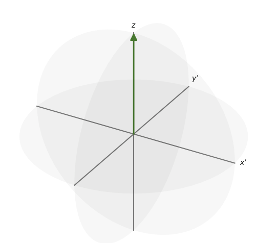
### **`Describing Trajectory of appling the RF pulse`**
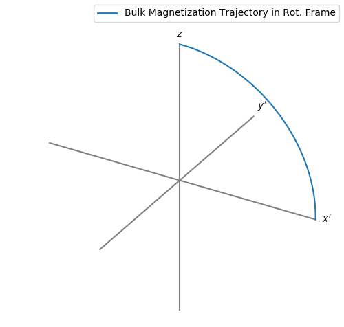
### **`Recovery or relaxation state for the magntization vector from X-Y to Z plane`**
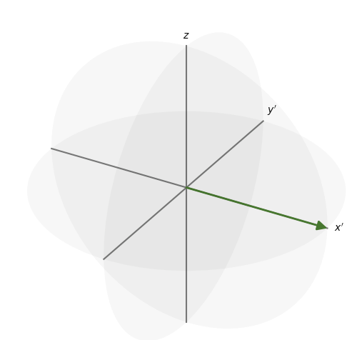
### **`Describing Trajectory of relaxation from X-Y to Z plane`**
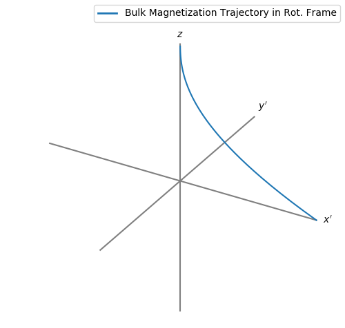
### **`The magnitude of image after applying Fourir transform`**
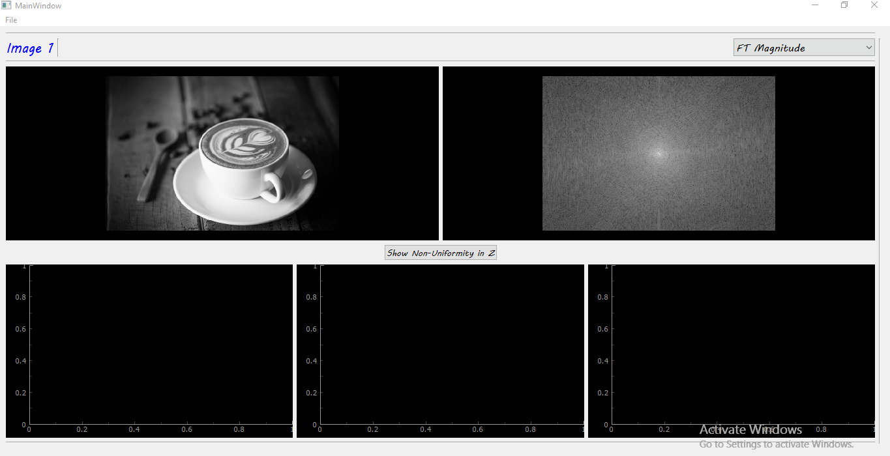
### **`The phase of image after applying Fourir transform`**
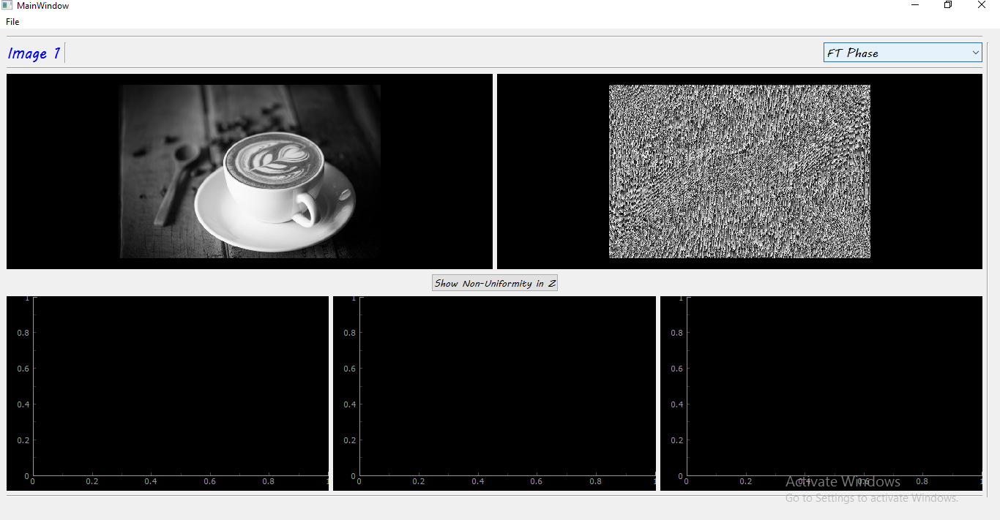
### **`The non uniformaty of magnatic field at Z-plane the equals (0,0,Bz) without any gradient applied`**
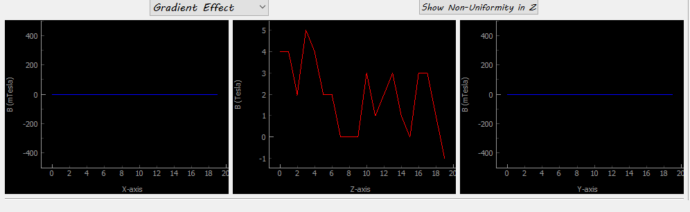
### **`The slice selection applied`**
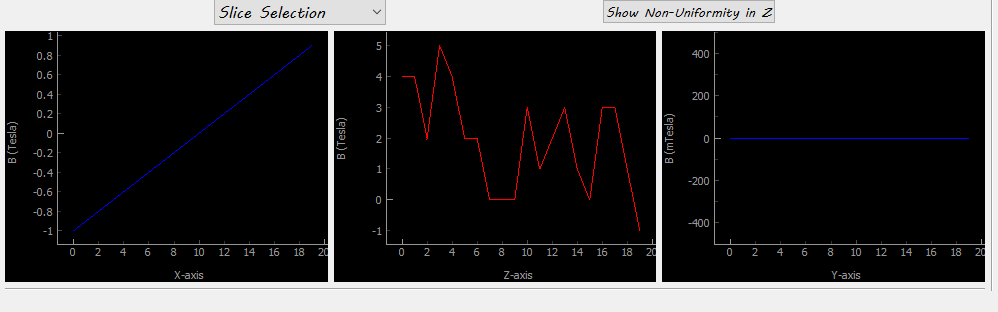
### **`The  phase encoding applied`**
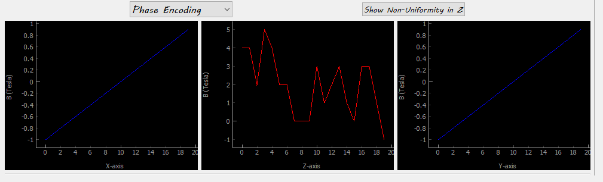
### **`The frequancy encoding applied`**
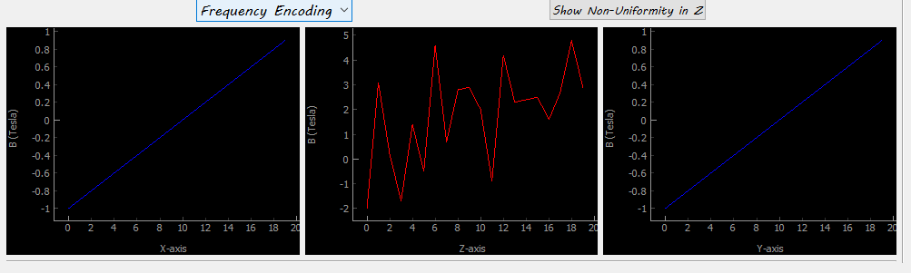
### **`The full Gui output and real componant of the image after fourier transform`**
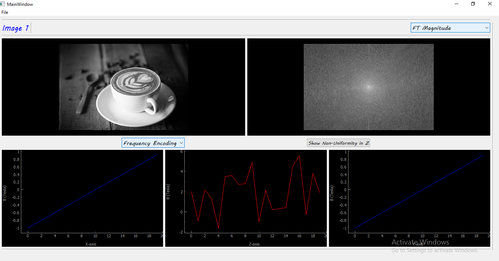
### You also can find another example for 140 Rf pulse in the OUTPUT folder.

# **`DEPENDENCIES`**
### main.py was written in Python 3, using libraries Matplotlib and Numpy  main.py uses ffmpeg to create animated gif , so ffmpeg needs to be installed from (https://www.ffmpeg.org/).
### kspace.py was written in Python 3, using libraries Matplotlib, Numpy, PyQt5, scipy, cv2 and pyqtgraph.
### GUI.py must not be run, as it will give no output, it is used as imported in Kspace.py.

# **`HOW TO USE`**
### you must install all dependences that is not included in your device and just run any file by typing in terminal `python file_name.py.`


